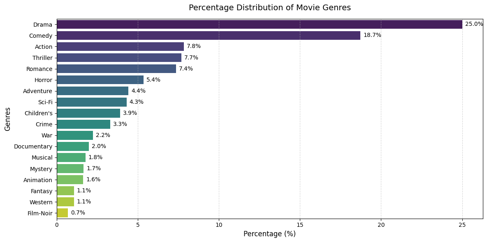
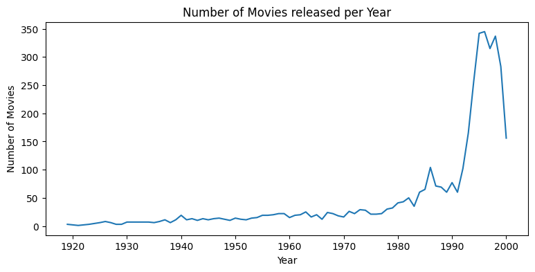
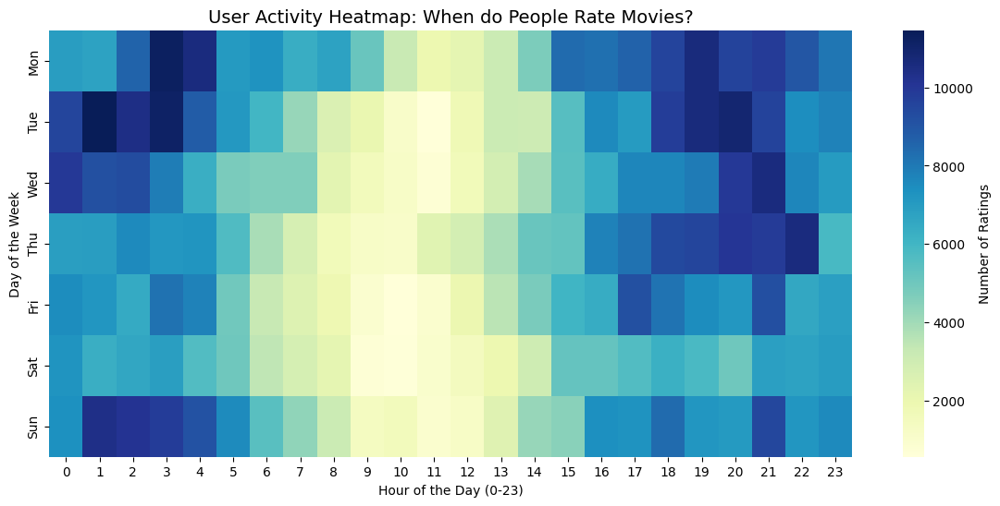
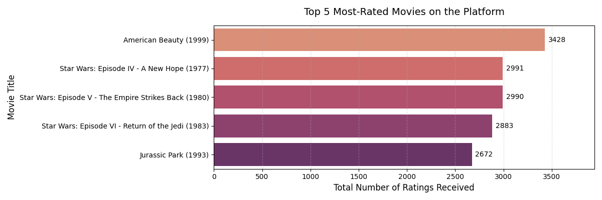
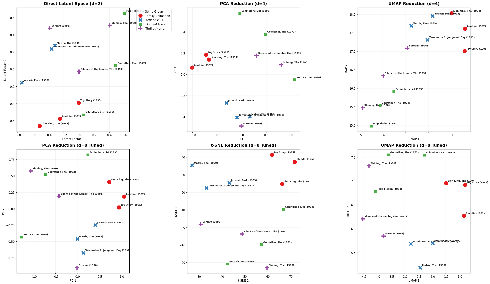

---

Part of the [DSML Business Case Studies](https://github.com/tarini-py/DSML-Business-Case-Studies) portfolio.

---

# Zee — Personalized Movie Recommender System

[](https://www.linkedin.com/in/mr-tps/)

### 🚀 Run on Google Colab
[](https://colab.research.google.com/drive/1Ci_ghn9NchNtplEZDdVbRefGQa-dMz0n)

### 📊 View on Kaggle
[](https://www.kaggle.com/code/tariniprasad0x/zee-recommender-systems)

## Problem Statement

Zee, a media/OTT platform, wants to increase engagement by recommending movies personalized to each user — based on their own rating history and the behavior of similar viewers. This case study builds three different recommendation approaches, benchmarks them against each other, and works out which one fits which part of the catalog: popular titles, niche titles, and brand-new users/movies with no history at all.

## Dataset

Three linked files (`::`-delimited), loaded from a shared Google Drive folder:

| File | ID range / scale | Key fields |
|---|---|---|
| `zee-users.dat` | UserIDs 1–6,040 | `Gender`, `Age` (7 buckets), `Occupation` (21 categories), `Zip-code` |
| `zee-movies.dat` | MovieIDs 1–3,952 | `Title` (release year parsed out via regex), `Genres` (pipe-separated, exploded for per-genre analysis) |
| `zee-ratings.dat` | one row per rating event | `UserID`, `MovieID`, `Rating` (1–5 whole stars), `Timestamp` |

Every user has rated at least 20 movies. *(The schema mirrors the well-known **MovieLens 1M** dataset, used here as the backing data for the Zee business scenario.)*

## Exploratory Data Analysis
 
- **Who rates:** mostly male users; the 25–34 age band is the most active rater group; `college/grad student` rates the most overall, and `executive/managerial` leads among users with full-time jobs.
- **Genre mix:** Drama (25.0%) and Comedy (18.7%) dominate the catalog; the remaining seventeen genres each make up less than 8%, with Film-Noir the rarest at 0.7%.

  
- **Catalog age:** new releases climb steadily through the dataset's window and peak in the **1990s** before tapering off.
  
- **When people rate:** activity was profiled by hour, day of week, and month to surface engagement rhythms — clear troughs appear in the late-morning hours across every day of the week.
  
- **What's popular:** *American Beauty (1999)* has the most ratings of any title in the catalog (3,428), based on a direct count of the raw ratings table.
  
  > **Note:** the notebook's own "Top 10 Most-Rated Movies" chart (built by merging ratings against the genre-exploded `movies` table) shows the Star Wars trilogy in the top spots instead. That's a duplicate-counting artifact — `movies.explode('Genres')` runs *before* that merge, so a rating for a movie tagged with 5 genres gets counted 5 times. The chart above uses `ratings.groupby('MovieID').count()` directly on the un-exploded data, which matches the notebook's own Questionnaire answer. Worth a one-line fix (`.drop_duplicates()` on MovieID before merging, or aggregating before the explode) if you want the in-notebook chart to match.

## Modeling Approach

Three recommendation strategies were built and benchmarked against each other:

**1. Pearson Correlation** *(item-based, memory-based CF)*
Built the user–movie pivot table *without* 0-filling missing ratings — an unrated movie is "unrated," not "disliked" — then computed a fully vectorized Pearson correlation matrix that respects `NaN`s. A **dynamic co-rater threshold** (10% of a title's raters, floor of 5) suppresses spurious "perfect correlation" results driven by one or two overlapping viewers on obscure titles.

**2. K-Nearest Neighbors with Cosine Similarity** *(item- & user-based, memory-based CF)*
Item–item and user–user similarity computed on a sparse `csr_matrix` for memory efficiency, with a `NearestNeighbors(metric='cosine')` model for fast top-N lookups.

**3. Matrix Factorization via `cmfrec`** *(model-based CF)*
Collective Matrix Factorization learns latent user/item embeddings **plus** side information — user demographics and cyclically-encoded rating-time patterns on one side, genres and normalized release year on the other — so the model can still make reasonable predictions for **cold-start users and movies**. Key modeling decisions:
- A **chronological 80/20 split per user** (never random — a random split would leak future ratings into training).
- Separate **warm-start** (movie seen in training) and **cold-start** (movie unseen in training) evaluation sets.
- Hyperparameters (`k`, `lambda_`) tuned with **Optuna** (30 trials, TPE sampler) against a chronological internal validation split, minimizing MAPE.

All three approaches are wrapped in live `ipywidgets` dashboards (dropdown + slider) for on-demand lookups, plus one combined dashboard that runs all three side by side for any selected movie.

## Results

**Error metrics, base vs. Optuna-tuned CMF model:**

| Model | Path | RMSE | MAPE |
|---|---|---|---|
| Base (k=4) | Warm-start | 0.9016 | 28.09% |
| Base (k=4) | Cold-start | 1.1320 | 42.47% |
| **Tuned (k=8)** | Warm-start | **0.8840** | **27.62%** |
| **Tuned (k=8)** | Cold-start | **1.0385** | **39.41%** |

**Ranking quality, held-out future ratings, Tuned CMF @10:**

| Metric | Value |
|---|---|
| Precision@10 | 5.6% |
| NDCG@10 | 6% |
| Overlap with training history | 23.2% |

The base model effectively failed to rank — it couldn't even surface movies a user had already watched. Tuning fixed that. Visualizing the item embeddings at d=2, d=4, and d=8 via PCA, t-SNE, and UMAP shows the tuned 8-dimensional model, viewed through UMAP, cleanly separating genre clusters — Animation, Action/Sci-Fi, Drama/Classic, and Thriller/Horror each land in their own region of the embedding space:



**Same movie, three answers** — top pick for *Toy Story 2 (1999)* by method:

| Method | Top pick | Note |
|---|---|---|
| Pearson Correlation | *Toy Story (1995)* | Best overall — all 5 results were on-genre family/animation titles |
| KNN (Cosine) | *Toy Story (1995)* | Strong start, but drifts toward generic 90s blockbusters (popularity bias) |
| Matrix Factorization (tuned) | *Toy Story (1995)* | Strong recovery after tuning — the base model had collapsed into unrelated 1930s/40s titles |

## Key Takeaways

- **Pearson Correlation** wins on well-rated, popular titles, but degrades into noise on sparse/niche titles — a single shared rater can manufacture a "perfect" correlation.
- **KNN (Cosine Similarity)** is reliable for "more of the same" recommendations but carries a popularity bias, since it doesn't correct for how many people rated a title.
- **Matrix Factorization** is the weakest of the three on ultra-popular titles out of the box, but is the only approach that scales to the full catalog, handles brand-new users/movies via side information, and surfaces non-obvious "long-tail" discoveries once tuned.

**Practical guidance:** Pearson for popular-catalog accuracy, KNN for genre-consistent "similar picks," Matrix Factorization when the priority is scale, novelty, or cold-start coverage.

## Tech Stack

`pandas` `numpy` `scikit-learn` `scipy` `matplotlib` `seaborn` `cmfrec` `optuna` `umap-learn` `ipywidgets` `gdown`

## How to Run

```bash
pip install optuna cmfrec
```

Open the notebook in Colab or Jupyter and run top to bottom — the data-loading cell pulls all three `.dat` files automatically via `gdown`. Note: the interactive recommendation widgets need a live kernel and won't render their controls in GitHub's static notebook preview.

---
